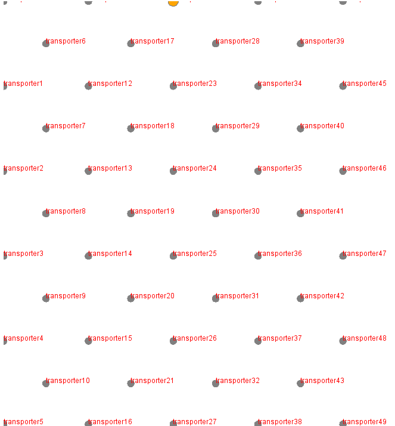
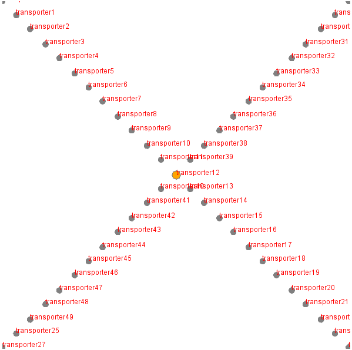
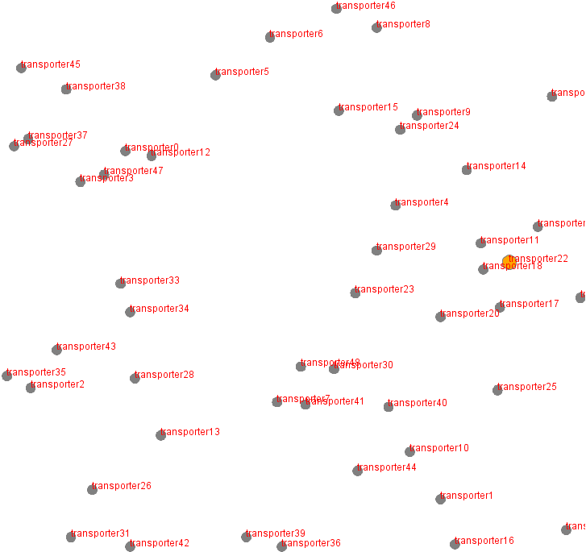
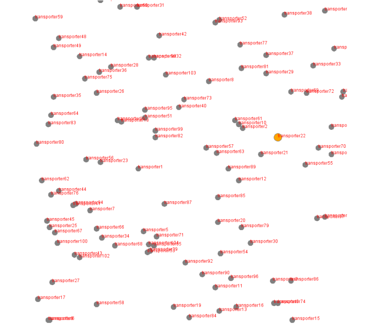

# Distributed Fault Detection For Multi-Agent Systems Based On Vertebrate Foraging
These files are the supplementary material for our paper "Distributed Fault Detection For Multi-Agent Systems Based On Vertebrate Foraging".

We present our distributed algorithm to detect malfunctioning units in multi-agent groups based on how social vertebrates, like chimpanzees, forage in groups for food. 
Agents with our algorithm use only the cooperation's outcome and limited communication range to form adaptive groups for a given task and to identify a malfunctioning member.
We evaluate our algorithm with simulated experiments in several setups where distributed agents have to form groups to achieve a given task. One agent of the agent population is malfunctioning and shall be identified.

We simulate several setups (Fig. 1, malfunctioning unit marked yellow) that simulates the cooperation between agents that control units as artifact, where one unit in the population is malfunctioning. 
The agents shall use our algorithm to determine in a decentralized way which unit is malfunctioning and still form groups that fit their given goal. For this, we use a combination of stigmergy (that is communication via the agents' common environment) and directed, limited communication between units that are in each others range.
Our approach is inspired by nature and the way how food foraging of social vertebrates works ([Cantor and Farine (2018)](https://doi.org/10.1002/ece3.4061) ). Like animals that group together to forage efficiently and reshape their ties to other members of their population to maximize survival chances, similarly our agents shall maximize the chances to fulfill their task.

We studied four different setups:
- checker board style with 50 units (setup A)
- diagonal with 50 units (setup B)
- random setup with 50 units (setup C50)
- random setup with 105 units (setup C105)

Fig. 1a - Initial setup for checker board sytle| Fig. 1b - Initial setup for diagonal sytle
:-------------------------:|:-------------------------:
 | 
Fig. 1c - Initial setup for free sytle with 50 units| Fig. 1d - Initial setup for free sytle with 105 units
 | 

## Contents
includes/ - contains .csv files for setup, described by units' positions

models/
- vertebrate_fault_detection.gaml : contains setup and behavior of agents and algorithm
- simulation_result/ - contains measured data \*.csv with tables of all values with results per model, name indicates which was applied. Entries show which initial setting was chosen for communication range. 
- snapshots/ : example pictures of the setups for visualization

## Setup of the artifact for [GAMA](https://gama-platform.github.io/)

- Install GAMA according to these [steps](https://gama-platform.github.io/wiki/Installation)
  -  [System Requirements](https://gama-platform.github.io/wiki/Installation#system-requirements)
- [Import the project into your workspace](https://gama-platform.github.io/wiki/ImportingModels)
- Run the included experiments in /models/failsafe_manufacturing.gaml:
  - "DecFaultDetection": run a simulation with an animated GUI
  - "Performance" and "PerformanceBigSize": run a batch of simulations to measure performance, with pre-sets according to parameters - different setups may be chosen. "BigSize" is for running the random setup with 150 units.
- Note that the simulation results are saved in separate files

